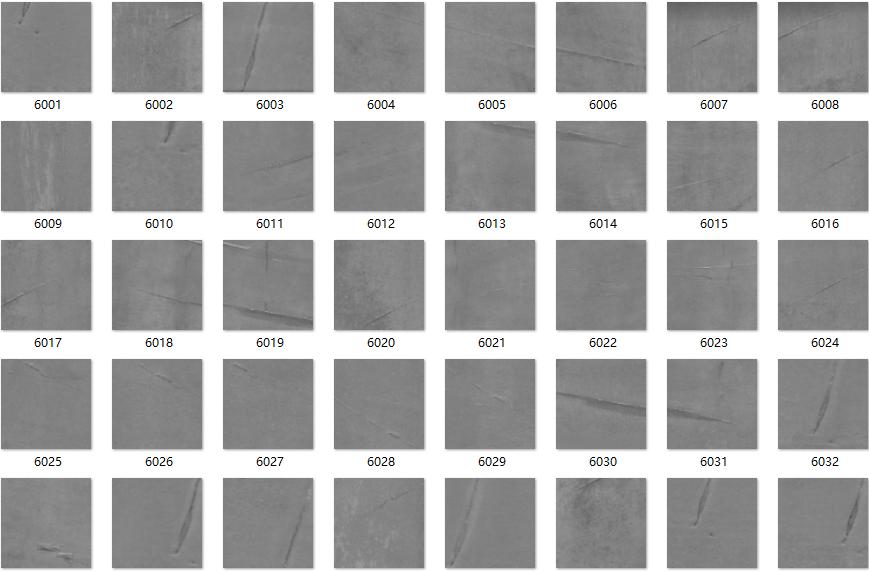
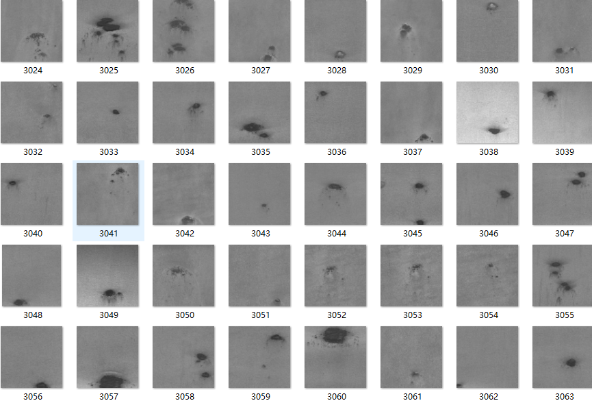
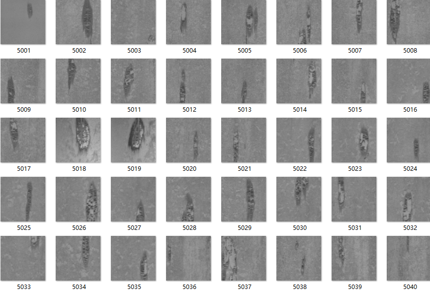
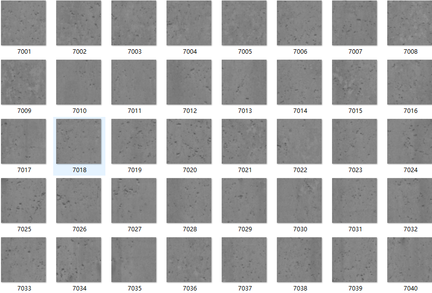
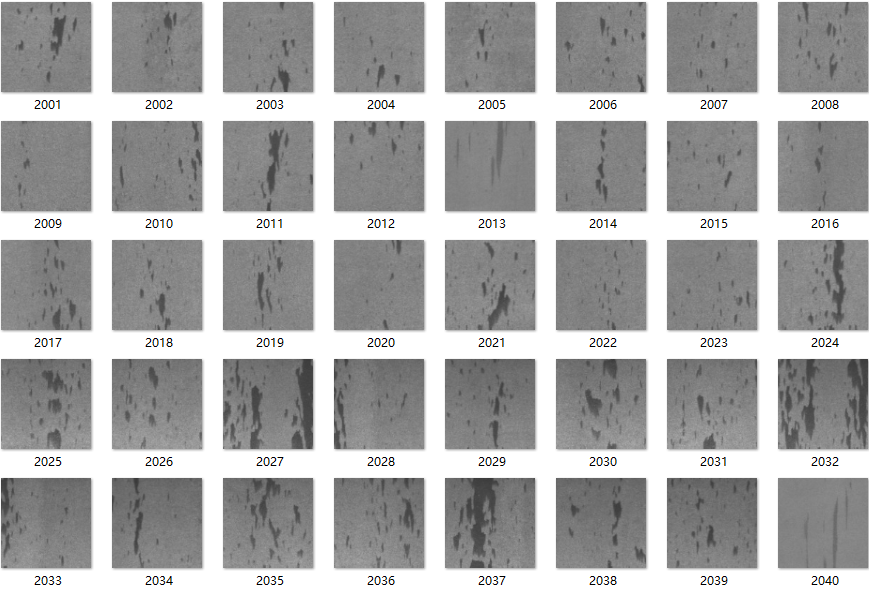
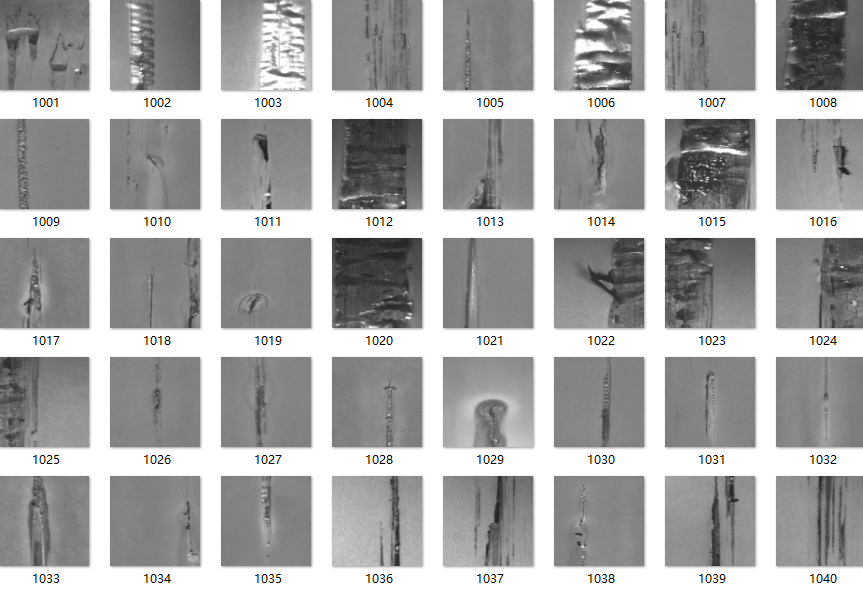
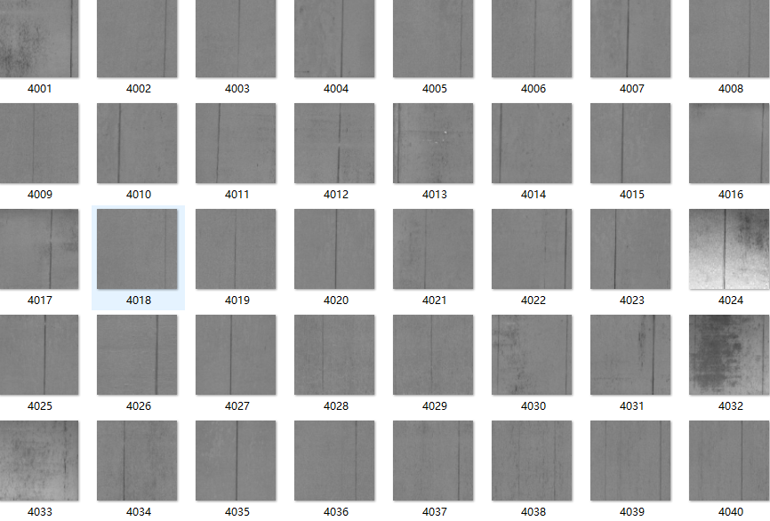

# 7 Types of Steel Defect Images Dataset

This dataset includes 7 types of steel defect images suitable for research on defect detection. It encompasses:
- finishing roll printing
- iron sheet ash
- oxide scale of plate system
- oxide scale of temperature system
- red iron
- slag inclusion
- surface scratch

All codes have been tested and there are no issues.
Before taking the pictures, please carefully read the description of the work, as it is very important because it involves different programming languages (Python or MATLAB, different versions).
The program is a special item that cannot be returned once sold. If you have any questions, please contact us in time.
5. The code will not be explained here.

## Images

Here is a pay link on Stripe ( https://buy.stripe.com/3cs8yP7sY87d0vu9AB ). Please contact me lonlonago@foxmail.com after funding $89, and I will send you a complete data files , thank you!

